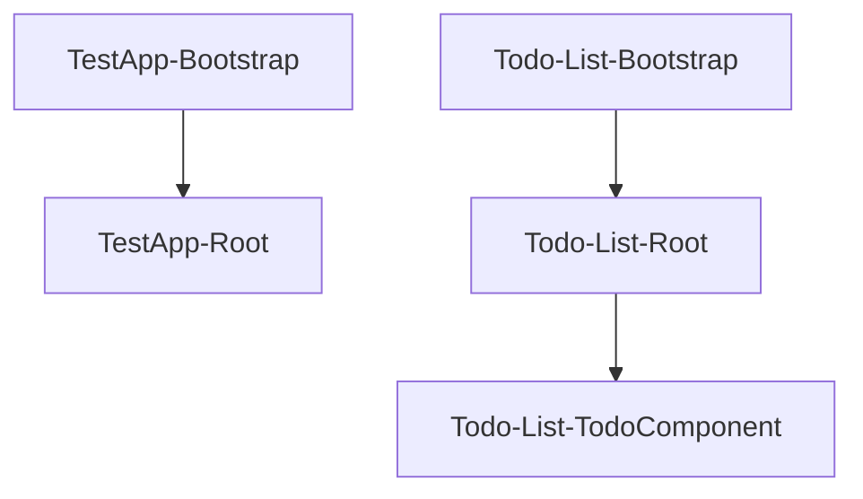

## 1. Stack
- TypeScript + Angular (two independent apps, different major versions)
- TestApp: Angular 20.3 (`@angular/core` ^20.3.0), standalone components, RxJS 7.8, zone.js 0.15 (TestApp/package.json)
- Todo-List: Angular 18.2 (`@angular/core` ^18.2.0), standalone components, RxJS 7.8, zone.js 0.14, plus Bootstrap 5.3 + jQuery 3.7 (Todo-List/package.json)
- Test runner: Karma + Jasmine in both apps (package.json devDependencies)
- No root-level manifest — repo root only holds two sibling Angular CLI projects

## 2. Directory map
| path | what lives there |
|---|---|
| README.md | repo-level generic Angular learning notes (not project-specific) |
| TestApp/ | Angular 20 CLI project root (package.json, angular.json, tsconfig*) |
| TestApp/src/ | app entry (main.ts), index.html, global styles.css |
| TestApp/src/app/ | root component `App` (app.ts/.html/.css), app.config.ts, app.routes.ts |
| TestApp/public/ | static assets (favicon.ico) |
| Todo-List/ | Angular 18 CLI project root (package.json, angular.json, tsconfig*) |
| Todo-List/src/ | app entry (main.ts), index.html, global styles.css |
| Todo-List/src/app/ | root component `AppComponent`, app.config.ts, app.routes.ts, MyCompunents/ |
| Todo-List/public/ | static assets (favicon.ico) |

## 3. Diagram

## 4. Component index
- [[TestApp-Bootstrap]]
- [[TestApp-Root]]
- [[Todo-List-Bootstrap]]
- [[Todo-List-Root]]
- [[Todo-List-TodoComponent]]

## 5. Entry points
- TestApp dev: `npm start` (runs `ng serve`) from TestApp/ — TestApp/package.json scripts.start; bootstrap file TestApp/src/main.ts
- TestApp prod: `npm run build` (runs `ng build`) from TestApp/ — TestApp/package.json scripts.build
- Todo-List dev: `npm start` (runs `ng serve`) from Todo-List/ — Todo-List/package.json scripts.start; bootstrap file Todo-List/src/main.ts
- Todo-List prod: `npm run build` (runs `ng build`) from Todo-List/ — Todo-List/package.json scripts.build

## 6. Conventions
- Both apps bootstrap with `bootstrapApplication(...)` (standalone, no NgModule) — TestApp/src/main.ts, Todo-List/src/main.ts
- TestApp uses Angular v20 file naming: app.ts/app.html/app.css, no ".component" suffix — TestApp/src/app/
- Todo-List uses classic naming: app.component.ts/.html/.css/.spec.ts — Todo-List/src/app/
- Todo-List nests feature components under src/app/MyCompunents/ (directory name as observed, nonstandard spelling) — Todo-List/src/app/MyCompunents/todo
- Each app owns its own package.json/angular.json/tsconfig*.json independently; no shared workspace config observed
- FLAGGED — error handling: TestApp/src/main.ts wraps an async IIFE that does `atob(process.env.AUTH_API_KEY)` to build a URL, fetches it with `node-fetch`, and passes the response body to `eval()`; failures are only caught and logged as `'Auth Error!'`. This is not standard Angular bootstrap code and `dotenv`/`node-fetch` are not listed in TestApp/package.json dependencies — verify before running/building this app.

## 7. Where things go
- New TestApp component: add files under TestApp/src/app/, register route in TestApp/src/app/app.routes.ts, wire into TestApp/src/app/app.ts template/imports
- New Todo-List component: add files under Todo-List/src/app/MyCompunents/, register route in Todo-List/src/app/app.routes.ts, import in Todo-List/src/app/app.component.ts
- New dependency: edit the specific app's own package.json (TestApp/package.json or Todo-List/package.json) — apps do not share dependencies
- App-wide providers/config change: TestApp/src/app/app.config.ts or Todo-List/src/app/app.config.ts
